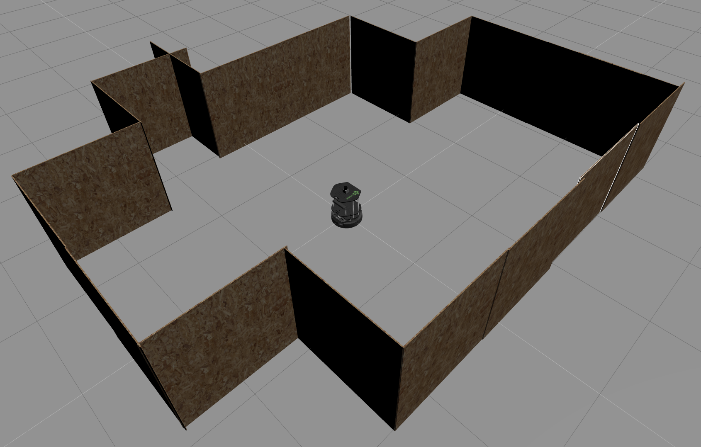

# ros
Simple projects in Robot Operating System (ROS).

ROS is an open-source system used for programming robots. In this project you can find multiple packages implemented for *autonomous robot*, specifically *Turtlebot*.

# What can I find here?

Note that *Gazebo* is used for the world and robot simulation in all the packages (except the one related to *Intro to ROS*). The communication with it is achieved through the topic */cmd_vel* (for publishing commands) and through the topics */odom*  and */kobuki/laser/scan* (for collecting information).

## Intro to ROS

Firstly, you can find very simple examples of 4 types of ROS Nodes in the to package *sensors*:
* Publisher
* Subscriber
* Service
* Action

The way they communicate is shown in the picture below. Node called */measurement* gets and publishes data from sensors, while the node */processing* processes it and sends further on.


## Movement control

Robot movement control is implemented in the package *kinematics*, including controllers for manual and autonomous movement.

To communicate with the controller just type in the mode you would like to use (manual or auto), followed by manually given velocity commands (for manual mode) or target position (for auto mode). Below you can find an example of the robot position after the executed commands sent by the user.

| |
|:---:|
| Robot's initial position () and target position () |

## Obstacles detection

Obstacles detection, particularly walls detection, is implemented in the package *perception*. *Split and Merge* algorithm is applied to the data retrived from laser scan through the topic */kobuki/laser/scan*, after which lines are extracted.

If you run *Rviz* in parallel, you can see the laser scan and deteceted walls visualized. On the following image(s) you can see the current robot's position in the world, laser scan visualized in Rviz, and detected wall lines, also visualized in Rviz.

| | |
|:---:|:---:|
| Robot's position in the world| Detected walls, visualized in Rviz |

# How to run these scripts?

To run any script simply type the following command(s) in a terminal:

```shell
  roscore # Type this only before running the very first script.
  rosrun <package> <script.py>
```

You can run any top-level script from the packages: *sensors*, *kinematics* and *perception*.

Note that if you want to perform world and robot simulation you should have **Gazebo**. Therefore, before running the aforementioned scripts you should run Gazebo by typing the following command(s) in a terminal:

```shell
  export TURTLEBOT3_MODEL=burger
  roslaunch turtlebot3_gazebo turtlebot3_world.launch
```

If you want to visualize obstacles detected by laser scan or extracted walls, simply type the following command(a) in a terminal to run **Rviz**. After that, add topics */kobuki/laser/scan* and */visualization_marker_array*.

```shell
  roslaunch turtlebot_rviz_launchers view_navigation.launch
```

Have fun!

